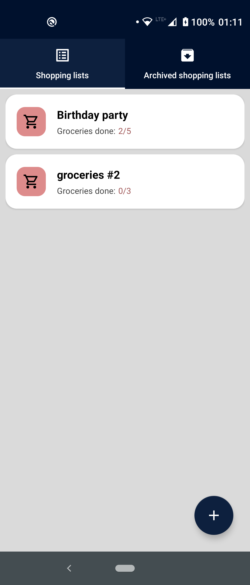
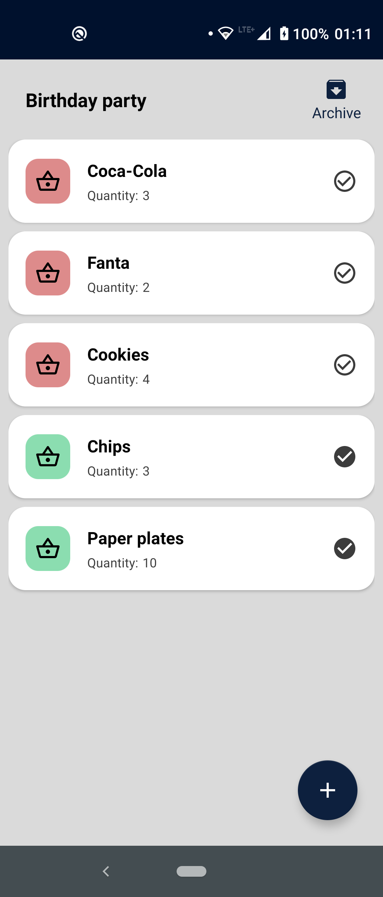
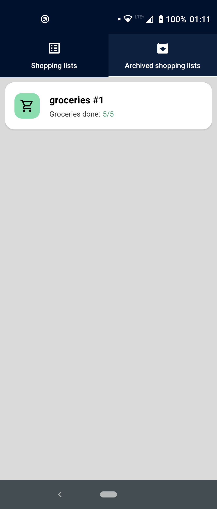
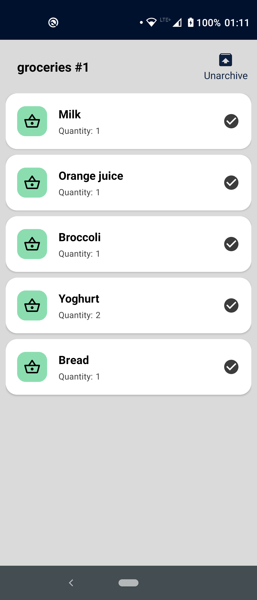

# shopping-lists
App for managing shopping lists, allowing user to:
- add / delete / archive / unarchive shopping lists
- add / delete items from lists

 <strong>Used libraries:</strong> 
- Room
- Data Binding
- ViewModel, LiveData
- Navigation
- Hilt
- Coroutines

 <strong>App preview:</strong>  

Active shopping lists: 

  
  

Archived shopping lists: 

  
  

 
